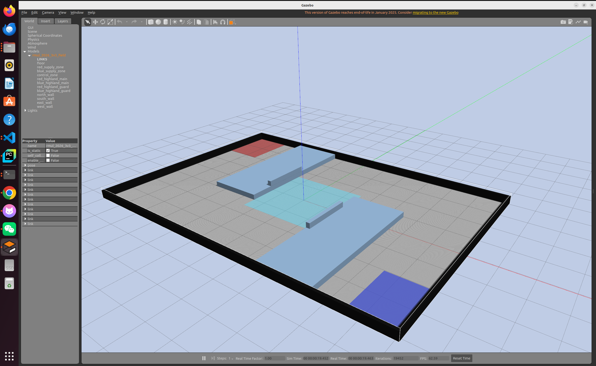

# RMUL 2026 3v3 Gazebo Field



A configurable Gazebo Classic field package for RMUL 2026 3v3 navigation and simulation work. The layout is generated from the field specification and keeps dimensions and object placement in one editable configuration file.

## Configuration

Edit [`config/field_config.json`](config/field_config.json) to update field dimensions, supply zones, highlands, guard rails, and wall geometry. Regenerate the world after changing the configuration:

```bash
python3 src/rm2026_field/scripts/generate_field.py
```

The generated world is stored at `worlds/rmul_2026_3v3.world`.

## Build and Launch

From the workspace root:

```bash
source ~/Desktop/workspace/sentry-navigation/env.sh
colcon build --symlink-install --packages-select rm2026_field
ros2 launch rm2026_field rmul_2026_3v3.launch.py
```

Run without the Gazebo GUI:

```bash
ros2 launch rm2026_field rmul_2026_3v3.launch.py gui:=false
```

## Coordinate Convention

The red-side near end is the coordinate reference. Blue-side field elements are generated by a 180-degree rotation about the field center so that the layout remains symmetric when dimensions change.

Perimeter-wall dimensions are simulation settings and can be adjusted independently of the competition specification. The world uses only local assets and does not require online Gazebo model downloads.
