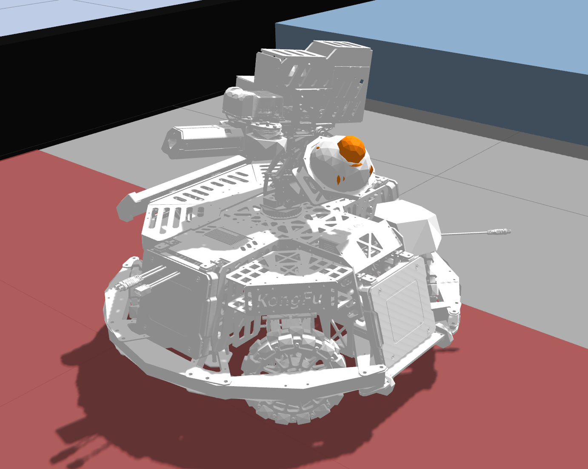

# Sentry Robot Description



ROS 2 Humble description and Gazebo Classic simulation package for the RoboMaster sentry robot.

The model includes the chassis, four suspension and wheel assemblies, a yaw gimbal, and a simulated Livox MID-360. The lidar is attached to the yaw assembly and can sweep with the gimbal to reduce occlusion during mapping and navigation experiments.

## Launch the Simulation

From the workspace root:

```bash
source ~/Desktop/workspace/sentry-navigation/env.sh
ros2 launch sentry_description gazebo.launch.py
```

This launch starts the RMUL 3v3 field and spawns the robot. The simulation uses planar kinematic motion for navigation development; it is not intended to validate chassis dynamics or motor control.

## Package Layout

- `urdf/sentry.urdf.xacro`: robot links, joints, sensors, and Gazebo plugins.
- `meshes/`: visual meshes used by the robot model.
- `config/`: controller and simulation parameters.
- `launch/`: Gazebo launch files.

## Related Packages

- `rm2026_field`: configurable RMUL 2026 3v3 field.
- `sentry_navigation`: MID-360 simulation, mapping, localization, and Nav2 configuration.
